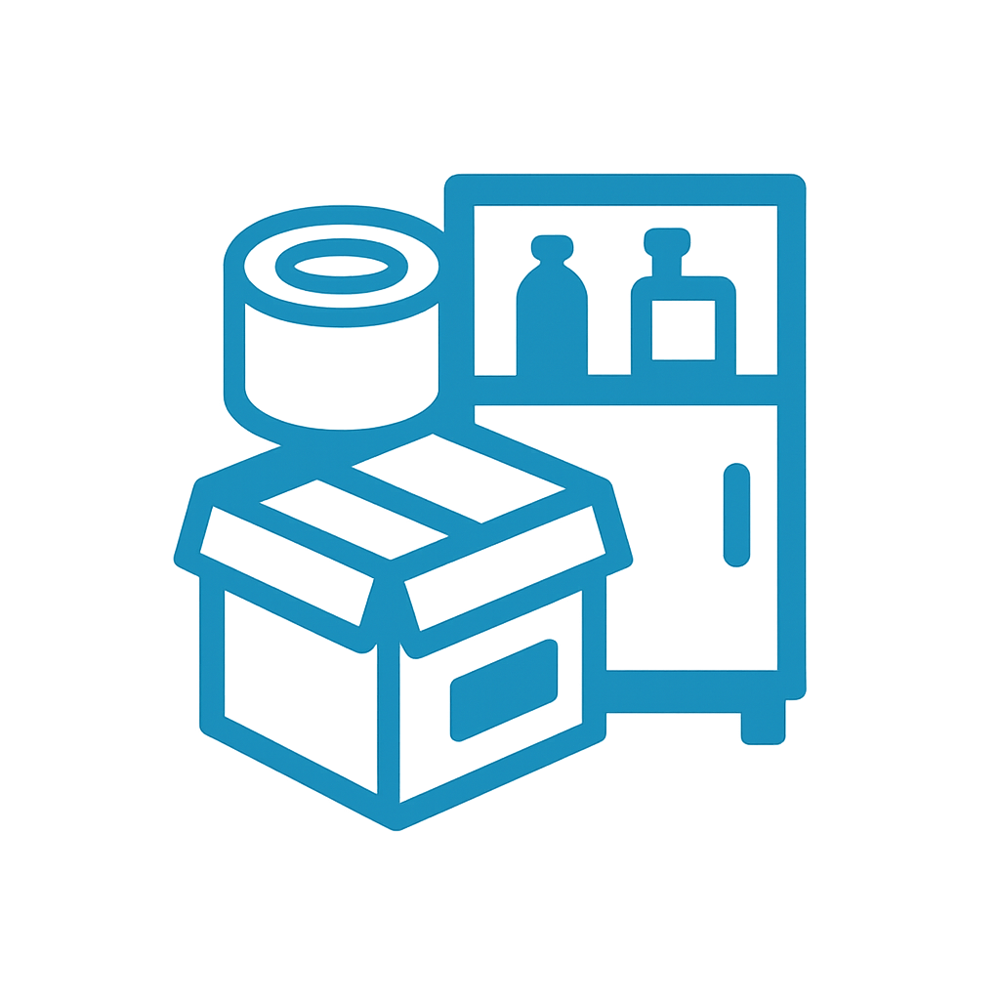
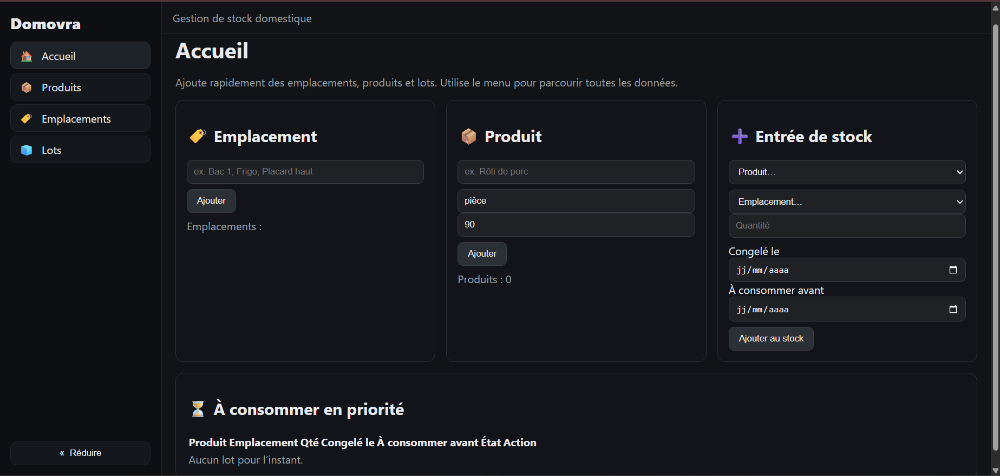

# Domovra – Gestion de stock domestique

**Domovra** est un module complémentaire Home Assistant permettant de gérer vos stocks alimentaires (frigo, congélateur, placards) avec suivi des dates limites de consommation (DLC), recherche et filtres.  
Il fonctionne directement dans l’interface Home Assistant grâce à **Ingress**, sans configuration réseau supplémentaire.

---

## 🚀 Installation

### 1. Ajouter le dépôt
1. Ouvrez Home Assistant.
2. Allez dans **Paramètres** → **Modules complémentaires** → **Boutique des modules complémentaires**.
3. Cliquez sur **⋮** (menu en haut à droite) → **Dépôts**.
4. Ajoutez l’URL du dépôt :  
https://github.com/bryan1993-HA/domovra-addons
5. Cliquez sur **Ajouter** puis **Fermer**.

---

### 2. Installer Domovra
1. Dans la boutique, recherchez **Domovra (Stock Manager)**.
2. Cliquez sur **Installer**.
3. Attendez la fin du téléchargement.

---

### 3. Lancer le module
1. Cliquez sur **Démarrer**.
2. Activez l’option **Afficher dans la barre latérale** (facultatif).
3. Cliquez sur **Ouvrir l’interface Web** pour accéder à l’application.

---

## ⚙️ Configuration

Le module ne nécessite pas de configuration complexe.  
Deux options sont disponibles dans les paramètres :

- **`retention_days_warning`** *(par défaut : 30)*  
Nombre de jours avant la DLC pour afficher un avertissement.

- **`retention_days_critical`** *(par défaut : 14)*  
Nombre de jours avant la DLC pour afficher une alerte critique.

> 💡 Ces paramètres sont optionnels et peuvent être laissés par défaut.

---

## 🖥️ Fonctionnalités

- Interface web intégrée à Home Assistant via **Ingress**.
- Gestion illimitée de **produits**, **emplacements** et **lots**.
- Système de recherche et filtres avancés.
- Indication visuelle des DLC proches ou dépassées.
- Multi-appareils : fonctionne sur PC, tablette, smartphone.

---

## 📸 Captures d’écran

**Vue d’ensemble**

---

## 🛠️ Support

- **Documentation** : [Guide complet](https://github.com/bryan1993-HA/domovra-addons/blob/main/domovra/DOCS.md)  
- **Journal des modifications** : [Releases](https://github.com/bryan1993-HA/domovra-addons/releases)  
- **Signaler un problème** : [Issues GitHub](https://github.com/bryan1993-HA/domovra-addons/issues)

---

## 📜 Licence
Ce projet est sous licence **MIT**. Vous êtes libre de l’utiliser, le modifier et le redistribuer sous réserve de conserver les mentions d’auteur.
